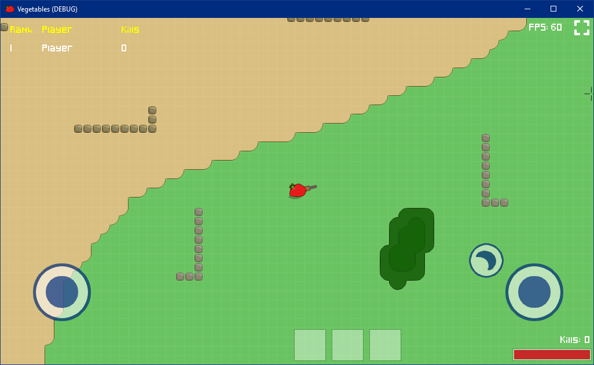
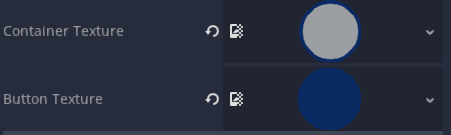

 # virtual-joystick
Virtual joystick plugin for Godot Engine.



## Installation
### GIT
You can install the plugin with GIT.

```bash
cd /path/to/project
mkdir -p addons
cd addons
git clone https://github.com/rohanrhu/virtual-joystick
```

## Usage
### Add a `Virtualjoystick` node.
### Add a `CollisionShape2D` and set a `CircleShape2D` to that.
### Set container and button textures


## Events
### `controlling`
Fires during user control.

### `trimming`
Fires while button is trimming to container's border.

### `released`
Fires when user released the joystick.

## Properties
### `container_texture: Texture`
### `button_texture: Texture`
### `is_mouseover: bool`
### `is_dragging: bool`
### `is_trimming: bool`
### `angle: float`
### `velocity: Vector2`

## Notices
* While you are testing it on mouse, you may want to enable `Project Settings > General > Input Devices > Pointing > Emulate Touch From Mouse` setting.

 ## License
MIT